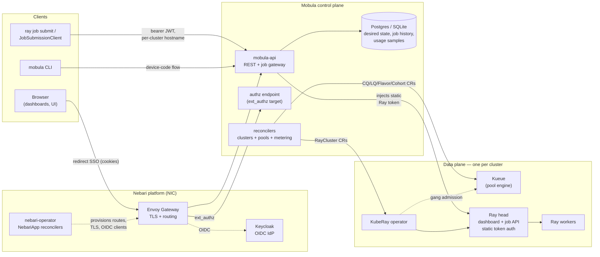
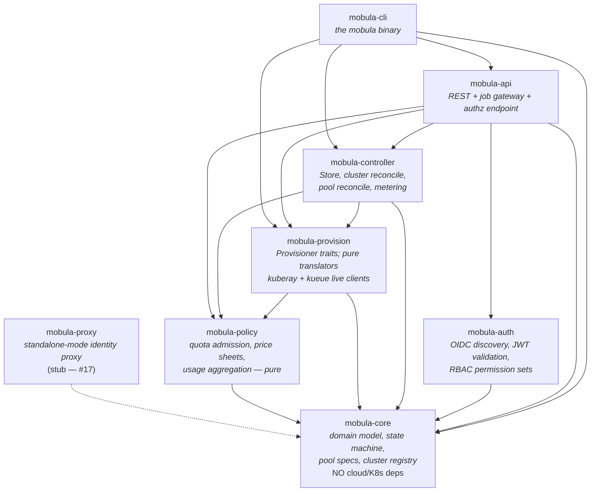
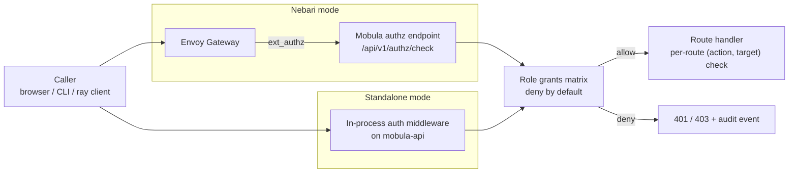
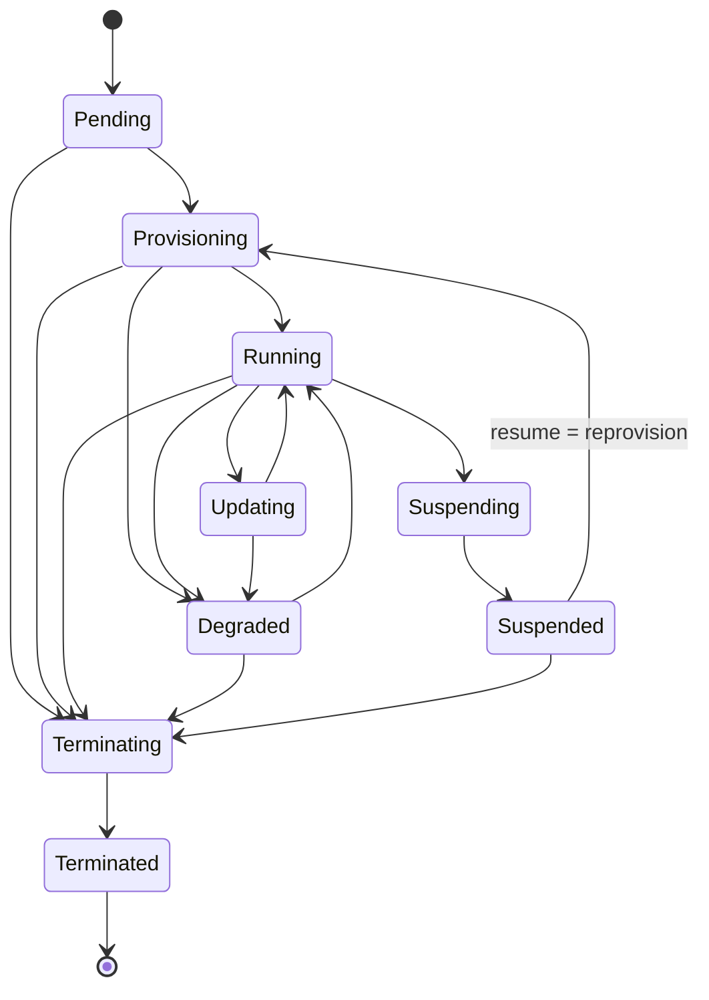
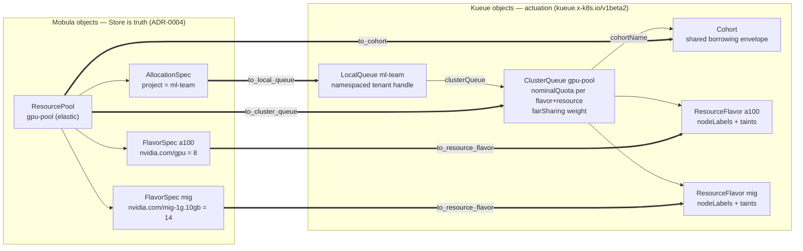
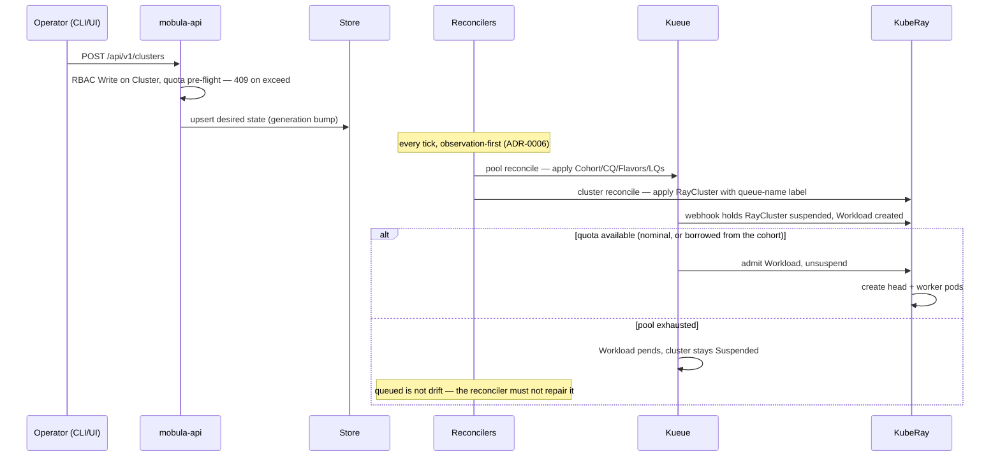
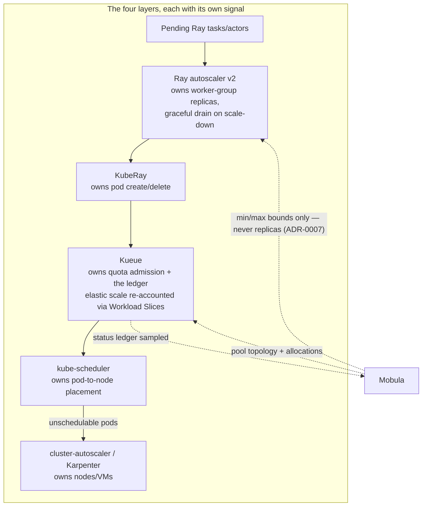
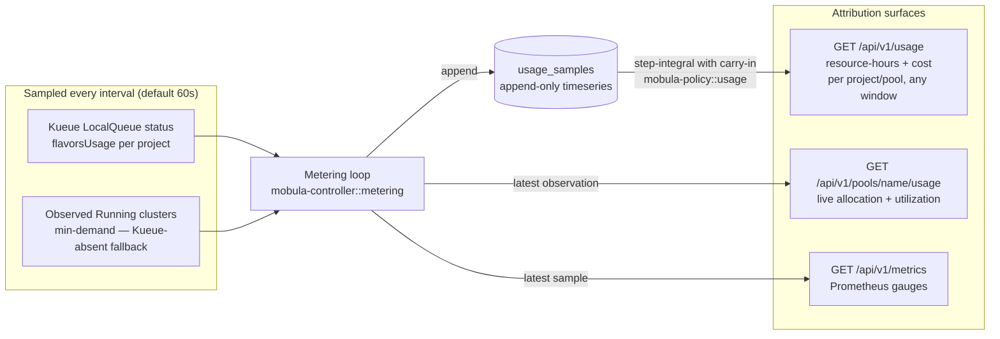
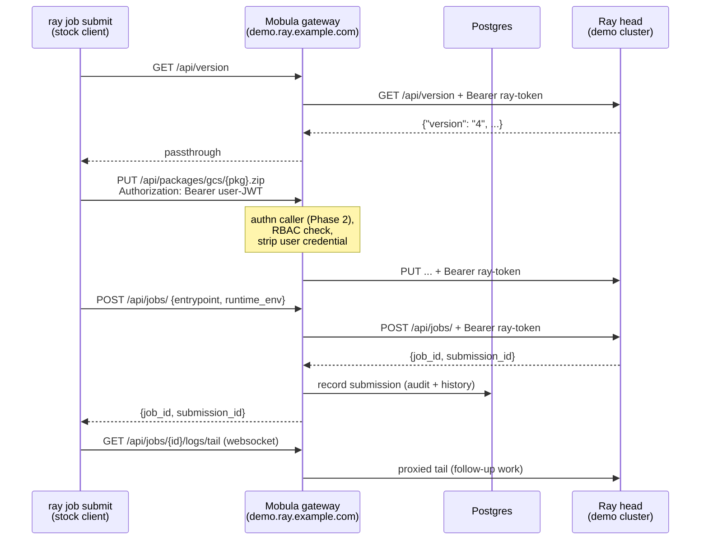

# Mobula Architecture

How the pieces fit together. Decisions and their evidence live in
[../PLAN.md](../PLAN.md) and [adr/](adr/); this document is the map.

## System context

Mobula is a control plane *beside* Ray, never inside it: it manages cluster
lifecycle, identity, pools, and access, while Ray schedules tasks
(ADR-0001). In Nebari mode the platform supplies browser SSO, ingress, and
TLS; Mobula supplies everything identity-shaped that involves a bearer token.

Key invariant (ADR-0003): a caller's credential terminates at Mobula; only
the cluster's static Ray token travels southbound. Nothing in the task
dispatch path goes through Mobula — Serve traffic is authorized via Envoy
`ext_authz`, not proxied inline.

## Crate map

Edges are real Cargo dependencies (each crate's `[dependencies]`). The two
dependency-poor anchors are `mobula-core` (no cloud/K8s deps, ADR-0002) and
`mobula-policy` (pure functions over domain types).

Pools follow the same split (ADR-0010): pool topology (`PoolSpec`,
flavors, allocations) lives in `mobula-core::pool`; translation to Kueue
objects is pure in `mobula-provision::kueue` with the live client in
`mobula-provision::kueue_client`; convergence (including the Kueue-absent
fallback) is `mobula-controller::pool_reconcile`; usage attribution is
`mobula-controller::metering` over `mobula-policy::usage`.

## Identity and access enforcement

Every surface is deny-by-default; the two modes differ only in *where* the
bearer check happens. The permission model is `PermissionType
{Read, Write, Delete, Admin}` × `Target {Job, Cluster, Service, Pool}`
(ADR-0009).

The credential swap (ADR-0003): the caller's JWT is validated and dropped
at this layer; only the cluster's static Ray token continues southbound, so
no user credential ever reaches a Ray cluster.

## Cluster lifecycle

The state machine in `mobula-core::cluster` — reconcilers may only move
clusters along these edges; anything else is a `TransitionError`:

Note the resume edge: suspended clusters released their compute, so they
re-enter `Provisioning` — there is no `Suspended --> Running` shortcut.

Observed state is reconstructed every pass, never stored as truth
(ADR-0006); drift raises a condition/alarm instead of a silent stomp
(ADR-0004), and every actuation carries a derived idempotency key
`{id}/{generation}` through the transactional outbox (ADR-0007).

## Resource pools — shared capacity (ADR-0010)

A Mobula `ResourcePool` is a thin control/attribution layer over **Kueue**:
Kueue enforces admission, cohort borrowing, and fair sharing; Mobula owns
the pool topology, the admission UX, and usage attribution. When the Kueue
CRDs are absent, pools degrade to the in-process quota path in
`mobula-policy` (REQUIREMENTS §3.2).

### Object mapping

Resource keys are arbitrary K8s resource names (`cpu`, `memory`,
`nvidia.com/gpu`, MIG slice resources, custom extended resources) — adding
a resource to a pool is a spec edit, not a code change. Kueue rejects
workloads that request a resource the ClusterQueue doesn't quota, and Ray
pods always request memory, so every flavor must cover `memory` too.

### Admission flow

### Who owns which scaling decision

### Usage attribution (billing-grade GPU-hours)

Kueue's `flavorsUsage` is a *reservation* ledger (what was admitted), not
measured consumption — so Mobula meters attribution itself:

## Job gateway request flow

The federating gateway (ADR-0002): northbound it is client-compatible with
the Ray Jobs API; southbound it proxies each cluster's real dashboard head.
One hostname per cluster because the stock client's paths carry no cluster
identity.

What the gateway deliberately does **not** do: reimplement any job endpoint
server-side (job records and packages live in Ray's internal GCS KV — see
PLAN.md review finding S2), or treat Postgres as the source of truth for
live job state (it holds registry + post-mortem history only, ADR-0004).

## Testing strategy

- **Unit**: state-machine legality, spec validation, pure translators
  (`kuberay.rs`, `kueue.rs`), quota/usage math — in each crate.
- **Store conformance** (`crates/mobula-controller/tests/store.rs`): the
  same scenarios (clusters, pools, allocations, usage samples) run against
  both the in-memory and SQLite stores.
- **Gateway integration** (`crates/mobula-api/tests/gateway.rs`): a mock
  Ray head records everything it receives; tests assert host routing,
  credential swap (user JWT never reaches the cluster), body passthrough,
  fallthrough to control-plane routes, and 502 on unreachable clusters.
  Runs in CI with no cluster required.
- **Contract tests** (`contract.yml`, weekly cron + on change): replay the
  real Python `JobSubmissionClient` against the gateway fronting a live Ray
  head — the drift alarm KubeRay's history says we need (PLAN.md, gate S4).
- **E2E** (gated, on demand + weekly): `kuberay-e2e.yml` provisions a real
  RayCluster through the KubeRay backend on kind; `kueue-e2e.yml` adds Kueue
  and proves the pool contract (first cluster admitted, second queued on
  exhausted quota, clean teardown).
