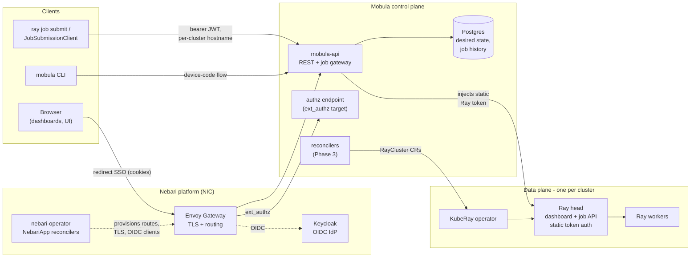
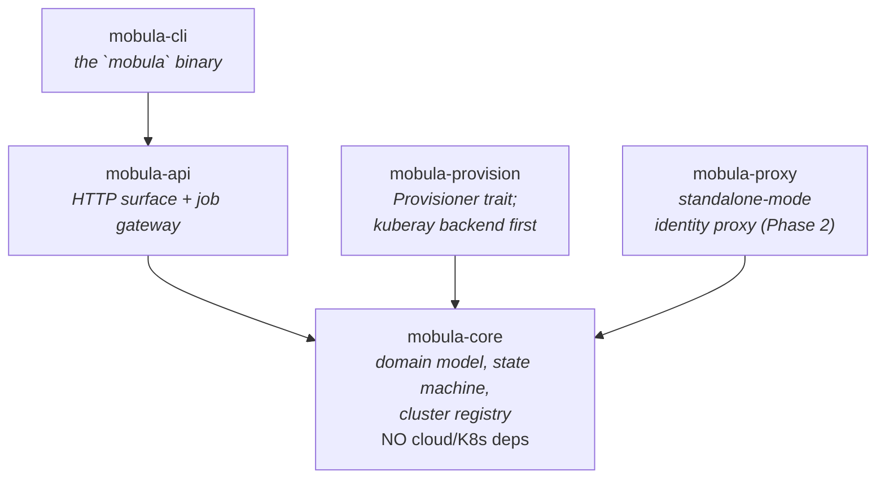
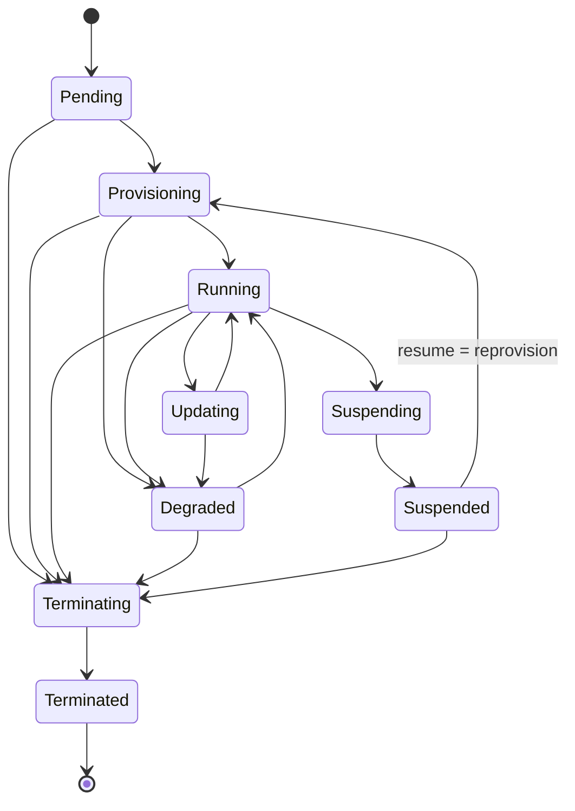
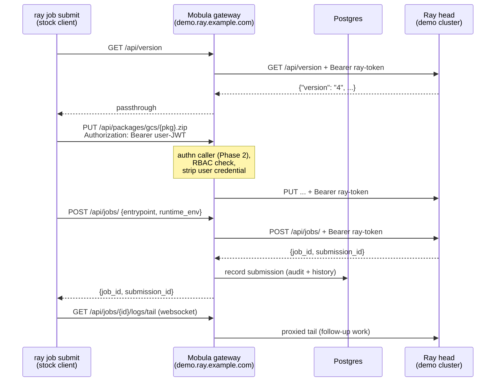

# Mobula Architecture

How the pieces fit together. Decisions and their evidence live in
[../PLAN.md](../PLAN.md) and [adr/](adr/); this document is the map.

## System context

Mobula is a control plane *beside* Ray, never inside it: it manages cluster
lifecycle, identity, and access, while Ray schedules tasks (ADR-0001). In
Nebari mode the platform supplies browser SSO, ingress, and TLS; Mobula
supplies everything identity-shaped that involves a bearer token.

Key invariant (ADR-0003): a caller's credential terminates at Mobula; only
the cluster's static Ray token travels southbound. Nothing in the task
dispatch path goes through Mobula — Serve traffic is authorized via Envoy
`ext_authz`, not proxied inline.

## Crate map

`mobula-core` is dependency-poor by rule (ADR-0002): cloud SDKs and
Kubernetes clients live only behind the `Provisioner` trait in
`mobula-provision`.

## Cluster lifecycle

The state machine in `mobula-core::cluster` — reconcilers may only move
clusters along these edges; anything else is a `TransitionError`:

Note the resume edge: suspended clusters released their compute, so they
re-enter `Provisioning` — there is no `Suspended --> Running` shortcut.

## Job gateway request flow

The federating gateway (ADR-0002): northbound it is client-compatible with
the Ray Jobs API; southbound it proxies each cluster's real dashboard head.
One hostname per cluster because the stock client's paths carry no cluster
identity.

What the gateway deliberately does **not** do: reimplement any job endpoint
server-side (job records and packages live in Ray's internal GCS KV — see
PLAN.md review finding S2), or treat Postgres as the source of truth for
live job state (it holds registry + post-mortem history only, ADR-0004).

## Testing strategy

- **Unit**: state-machine legality, registry host matching, token
  non-serialization — in each crate.
- **Gateway integration** (`crates/mobula-api/tests/gateway.rs`): a mock
  Ray head records everything it receives; tests assert host routing,
  credential swap (user JWT never reaches the cluster), body passthrough,
  fallthrough to control-plane routes, and 502 on unreachable clusters.
  Runs in CI with no cluster required.
- **Contract tests** (next): replay the real Python `JobSubmissionClient`
  against the gateway fronting each supported Ray minor — the drift alarm
  KubeRay's history says we need (PLAN.md, gate S4).
- **E2E** (later): kind + KubeRay via the rayserve-pack chart.
