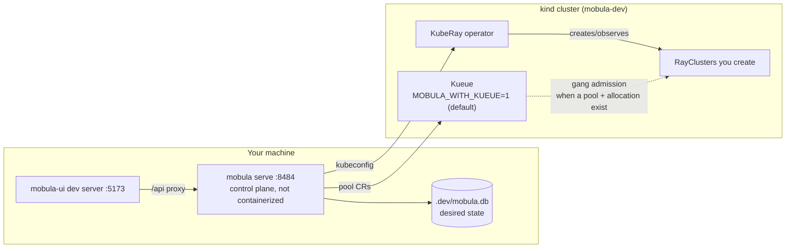

# Local dev stack

A one-command local Mobula: a [kind](https://kind.sigs.k8s.io/) cluster with
the KubeRay operator, the control-plane API server, and the dashboard. This is
the setup for kicking the tires and stress-testing — everything real (real
KubeRay, real RayClusters), just on your laptop.

> **Not for production.** `serve` runs unauthenticated on loopback. Never
> expose the port; production needs `--auth-config` (OIDC) and TLS.

## Prerequisites

`kind`, `kubectl`, `helm`, `docker` (running), `cargo`, and — for the UI —
`node`/`npm`. On macOS: `brew install kind kubectl helm`.

For the dashboard, check out [`mobula-ui`](https://github.com/brandonrc/mobula-ui)
as a sibling directory (`../mobula-ui`), or point `MOBULA_UI_DIR` at it.

## Quick start

```bash
./scripts/dev-stack.sh up        # kind + KubeRay operator + namespace (~2–3 min first run)

# terminal 1 — the control plane
./scripts/dev-stack.sh serve

# terminal 2 — the dashboard
./scripts/dev-stack.sh ui        # → http://localhost:5173  (proxies /api → :8484)
```

Open the UI. The overview and cluster list are now backed by the live API;
create a cluster from the UI or with `curl` (below) and watch it reconcile.

When you're done:

```bash
./scripts/dev-stack.sh down      # delete the kind cluster and ./.dev state
```

## Verifying it works

```bash
./scripts/dev-stack.sh smoke          # fast: health + version + list (no image pull)
./scripts/dev-stack.sh smoke --full   # provisions a real RayCluster to running and back
./scripts/dev-stack.sh status         # operator, RayClusters, pods, control-plane health
```

`smoke` starts its own `serve`, exercises the API, and cleans up after itself —
it does **not** need `serve` already running (it does need `up`). `--full`
pulls `rayproject/ray` into the kind node the first time, so it can take several
minutes.

## Driving the API by hand

```bash
BASE=http://127.0.0.1:8484
curl -s $BASE/healthz                       # ok
curl -s $BASE/api/v1/version                 # {"name":"mobula","version":"..."}
curl -s $BASE/api/v1/clusters                # []

# create a small cluster (0 workers keeps the pull/footprint minimal)
curl -s -X POST $BASE/api/v1/clusters -H 'content-type: application/json' -d '{
  "id":"demo",
  "spec":{"name":"demo","project":"dev","ray_version":"2.57.0",
    "image":"rayproject/ray:2.57.0","head_cpu":"1","head_memory":"2560Mi",
    "worker_groups":[],"ttl_seconds":null}
}'

curl -s $BASE/api/v1/clusters/demo           # watch observed_state climb to "running"
curl -s -X DELETE $BASE/api/v1/clusters/demo # tear it down

# what KubeRay actually did:
kubectl get rayclusters,pods -n mobula-dev -o wide
```

The reconcile loop (default 10s here, `--reconcile-interval-secs`) converges
desired → observed; `observed_state` is `null` until the first observation,
then walks `provisioning → running`. The dashboard's state badge derives from
`observed_state`, falling back to `desired`.

## Configuration

Everything is env-overridable (defaults shown):

| Var | Default | Meaning |
|-----|---------|---------|
| `MOBULA_DEV_CLUSTER` | `mobula-dev` | kind cluster name |
| `MOBULA_DEV_NAMESPACE` | `mobula-dev` | namespace RayClusters live in |
| `MOBULA_KUBERAY_VERSION` | `1.4.0` | KubeRay operator chart (matches CI) |
| `MOBULA_BIND` | `127.0.0.1:8484` | serve bind (must match the UI's Vite proxy) |
| `MOBULA_DEV_DB` | `./.dev/mobula.db` | SQLite desired-state store |
| `MOBULA_UI_DIR` | `../mobula-ui` | mobula-ui checkout |
| `MOBULA_RESYNC_SECS` | `10` | reconcile resync interval |
| `MOBULA_WITH_KUEUE` | `1` | install Kueue into kind on `up` (`0` to opt out) |
| `MOBULA_KUEUE_VERSION` | `v0.19.1` | Kueue release manifest (matches `kueue-e2e.yml`) |
| `MOBULA_KIND_NODE_IMAGE` | `kindest/node:v1.34.0` | kind node image (Kueue v0.19 needs K8s ≥ 1.34) |

The SQLite `--db` means desired state survives `serve` restarts; `down` wipes
`./.dev`. State also persists across a `serve` restart *without* `down`, so you
can restart the control plane and it re-reconciles what's already there.

## How it fits together



`mobula serve` runs on the host and talks to kind through your kubeconfig — it
is **not** containerized for dev, so `cargo run` picks up code changes on a
plain restart. Only the Ray workloads run in the cluster. With Kueue
installed, `smoke --full` also creates a demo pool + allocation so the
queue-label admission path is exercised end to end.

## Troubleshooting

- **`serve` exits immediately** — the kube context is wrong or kind isn't up.
  `./scripts/dev-stack.sh up` (re)creates it; check `kubectl config current-context`
  is `kind-mobula-dev`.
- **Cluster stuck in `provisioning`** — almost always the image pull. Watch
  `kubectl get pods -n mobula-dev` and `kubectl describe raycluster -n mobula-dev`.
  Head pods need ≥ ~2.5Gi; too little RAM shows up as `CrashLoopBackOff`.
- **UI shows "control plane unreachable"** — `serve` isn't running, or `MOBULA_BIND`
  doesn't match the Vite proxy target (`127.0.0.1:8484`).
- **Smoke logs** — a background `serve` writes to `./.dev/smoke-serve.log`.
