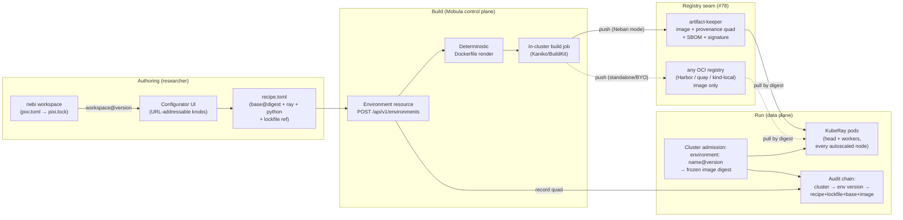

# Environments, images, and the reproducibility chain

Date: 2026-08-21. Companion to the environments epic (#65), the recipe ADR issue (#79), the registry decision (#78), and the credentials/storage design doc (#73). Records the planning decisions from the 21 Aug session following the Ray architecture discussion (18 Aug 2026).

## 1. The decision: declarative recipes, never user-authored Dockerfiles

An environment is a small declarative **recipe**. Mobula renders it to a Dockerfile deterministically; the user never writes or edits a Dockerfile. This resolves the tension from the architecture meeting — "abstract Dockerfiles in a configurable way" and "connect it to where we're creating environments" (nebi/pixi) are the same thing once the recipe is the abstraction and the lockfile is its payload.

```toml
# recipe.toml — the unit of reproducibility
base      = "nvcr.io/nvidia/cuda@sha256:..."   # digest-pinned, from an admin-curated base list
ray       = "2.52.0"
python    = "3.12"
env.nebi  = "workspace/team-a@v14"             # or: env.pixi_lock = "<digest>"
arch      = "gpu-h100"
system    = ["libgl1"]                          # allowlisted system package extras
```

Properties:

- **Deterministic render.** Same recipe ⇒ byte-identical Dockerfile. The render is a pure function with a golden-fixture test. A third party can re-render and diff.
- **The reproducibility quad.** Every successful build records four digests: recipe, lockfile, base image, result image. Together they answer "what exactly ran, and can we rebuild it?"
- **Admission freezing.** `ClusterSpec` gains `environment: name@version`, resolved to the result-image digest at admission and frozen onto the spec — the same never-trust-the-wire pattern as `pod_resolved` (#66 / PR #75). Autoscaled nodes joining later pull the digest the cluster was admitted with, never a floating tag.
- **Immutable versions.** `name@version` never changes once built. A new lockfile is a new version.
- **Fail at the form, not at boot.** Ray/Python compatibility validation from the lockfile (#69) runs at recipe admission.

## 2. The configurator (mobula-ui)

Modeled on the SGLang cookbook pages: every knob lives in the URL, and the output is copy-pasteable. Knobs are exactly the recipe fields — base, Ray, Python, arch, nebi workspace or pixi.lock, system extras. Three live panes: `recipe.toml`, the rendered Dockerfile preview (read-only proof, not an editor), and generated `mobula env build` / Python SDK commands. A URL pasted into a fresh browser reproduces the configuration exactly, so an environment proposal can be shared in a Slack message or an issue. Tracked as mobula-ui #1.

## 3. Where artifact-keeper sits



The seam (#78): Mobula **requires** from any registry only digest-addressable push/pull reachable from worker nodes; it **exploits** artifact-keeper when present — provenance-quad storage, SBOM, signing, SSO'd push tokens. Nothing in M4 hard-blocks on the artifact-keeper-as-NIC-core decision, but reproducibility is strongest when that decision lands. This is the one-page argument for making artifact-keeper part of the core NIC build: nebi gets a place to put images, Mobula gets provenance, and air-gapped installs get a single mirrored registry story (Iron Bank-substitutable bases per ADR-0008).

## 4. Work swimlanes (who is blocked on whom)

| Lane | Work | Waits on |
|---|---|---|
| Mobula team, now | M1 (pod shaping, TLS, CI), M3 (self-service), M2 doc drafts, M4 recipe/renderer/configurator against dev-stack's local registry | nothing |
| Decisions | Ray-only scope ADR (#64), artifact-keeper-as-core (#78), storage split guardrail numbers (#73), credential shape (#73), budget semantics (#77) | Dharhas/Kim/NIC council — #73 is the forcing function |
| Other repos / infra | RWX home-dir PVC across ray ↔ data-science-pack namespaces (Longhorn research), nebi lockfile API (#67), artifact-keeper deploy + push tokens, Keycloak group claims in JWTs, pod identity (IRSA/WIF), NebariApp per-cluster routing (mobula-pack #7) | NIC / nebari-operator / nebi |

NIC-facing surface is deliberately thin — a registry URL + push credential, an RWX StorageClass, and group claims in tokens — all consumed as configuration so infra choices can change underneath.

## 5. Milestone map (created 2026-08-21)

- **M1: Data path reachable** — PR #75, #66, #76, #2, mobula-api #1 (spec re-sync)
- **M2: Decisions on paper** — #73, #64, #77 (budgets), #78 (registry)
- **M3: Self-service v1** — #74, #48, #49, #51, #71, #72, #18
- **M4: Environments & images** — #65, #67, #68, #69, #70, #79 (recipe ADR), #54, mobula-ui #1
- **M5: Platform integration** — #55, #50, #52, #63, #6, mobula-pack #1–8
- Unmilestoned/future: #53 (multi-cloud VM provisioners)
